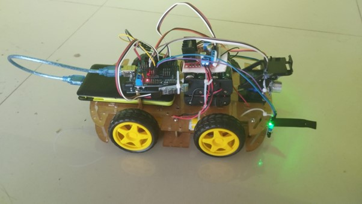
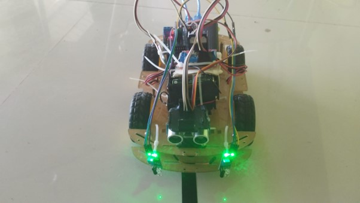

# Carrito Multi-Modo con Arduino

Se pretende desarrollar el código para un carrito tri-modal construido con Arduino, capaz de ser controlado por Bluetooth, operar de forma autónoma y seguir líneas.

## ¿Que hace el carrito?

El carrito Tri-modal desarrollado con Arduino es capaz de funcionar en tres modos distintos:

- Puede ser controlado remotamente mediante Bluetooth
- Seguir líneas de forma autónoma utilizando sensores
- Evitar obstáculos Utilizando un sensor ultrasonico.

## ¿Que aprendemos?

Desarrollar este proyecto nos permite obtener experiencia práctica en programación, electrónica y diseño. Explorar la arquitectura y el funcionamiento de las placas de desarrollo y microcontroladores. Fomenta la creatividad, la resolución de problemas y nos prepara para desafíos reales.

## Como construir el carrito (No se presenta una guía detallada del armado físico)

### 1. Conseguir los siguientes materiales

- 1 Placa Arduino Uno
- 1 Sensor Shield V5.0
- 1 MotorDriver L298n
- 1 Sensor HC-SR04 (Ultrasonico)
- 2 Sensores infrarrojo FC-51
- 1 Modulo Bluetooth HC-05
- 1 Servomotor y sus soportes
- Cables
- Chasis Carrito
- 4 Ruedas
- 4 Motores reductores
- 1 Batería 12v o 2 a mas de menor voltaje.

> También se puede adquirir un kit en Aliexpress.

> Escoger el que mejor les convenga.

### 2. Descargar el código del proyecto desde GitHub

- [Pagina en GitHub](https://github.com/Richard-Roman/CarritoMultiModo-Arduino.git)

### 3. Detalles a tener en cuenta

- Instalar las bibliotecas necesarias para los sensores y la comunicación por bluetooth.

### 4. Armado físico del carrito

1. Elaborar el chasis soldando cables a los 4 motores y ensamblando las ruedas.
2. Montar el circuito conectando el motordriver al Arduino y probando el funcionamiento de los motores.
3. Ensamblar el servomotor con sus soportes en el chasis.
4. Sobre el soporte del servomotor, colocar el sensor ultrasonico.
5. Conectar los diferentes sensores al Arduino:
    - Sensor ultrasonico:
        - TRIG al pin A0
        - ECHO al pin A1
    - Modulo Bluetooth
        - TX al pin 6
        - RX al pin 7
    - MotorDriver L298n
        - IN1 al pin 2
        - IN2 al pin 3
        - IN3 al pin 4
        - IN4 al pin 5
    - Servomotor
        - PWM al pin 9
    - Sensores infrarrojos
        - OUT del sensor izquierdo al pin A4
        - OUT del sensor derecho al pin A5
6. Realizar pruebas del funcionamiento autónomo, control por Bluetooth y seguidor de lineas.
7. Ajustar y corregir el código según sea necesario.
8. Realizar la prueba final para asegurar el correcto funcionamiento del carrito Multi-Modo.

> [!IMPORTANT]
>
> - Asegúrese de personalizar el código para adaptarlo mejor a su propio proyecto.
> - Revise la conexión de los motores al motordriver para asegurarse de que el carrito se mueva según el código.

> [!TIP]
>
> - Puede buscar tutoriales en Youtube que le ayuden a armar su carrito. Hay muchos.
